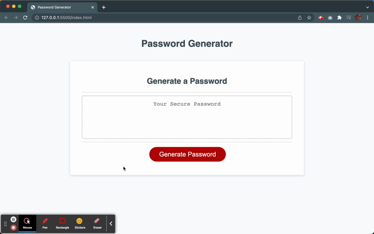

# Session 3 Homework

## JavaScript: Password Generator

A random password generator based on criteria that users have selected in prompts. 

The available selections are:

* Length (8 - 128)
* Lower case letters
* Upepr case letters
* Numbers
* Special characters

Results: 
[GitHub Page](https://r-alo.github.io/hmwSession3/)
